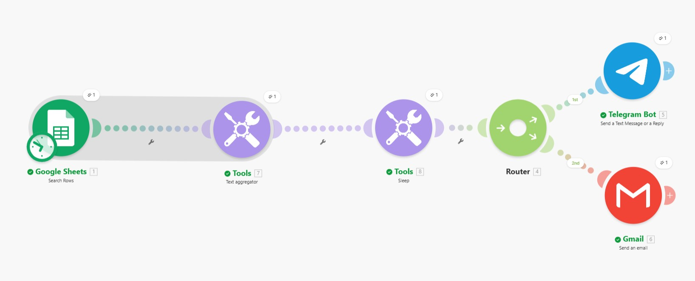
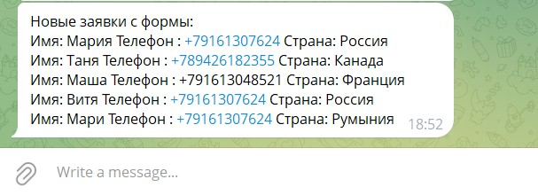
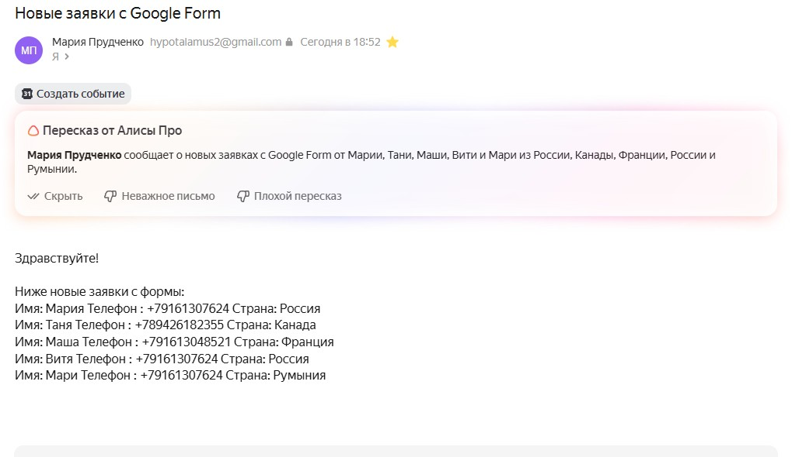

# Автоматизация обработки заявок из Google Form

## О проекте
Этот проект автоматизирует сбор заявок из Google Form и отправку их в Telegram и Email через Make.

## Задача
Сделать так, чтобы заявки:
- не терялись
- приходили автоматически
- отправлялись в удобном виде
- не создавали спам из множества отдельных сообщений

## Как работает
Google Form → Google Sheets → Make → Text Aggregator → Router → Telegram + Email

## Что реализовано
- сбор данных из Google Form через Google Sheets
- получение строк в Make
- объединение нескольких заявок в один текст
- отправка одного сообщения в Telegram
- отправка одного письма на Email
- аккуратное форматирование заявок

## Почему это полезно
Без автоматизации каждую заявку пришлось бы проверять вручную.  
С автоматизацией новые заявки собираются и отправляются автоматически одним сообщением.

## Использованные инструменты
- Google Forms
- Google Sheets
- Make
- Telegram Bot
- Gmail / Email

## Результат
Теперь несколько заявок из формы приходят:
- одним сообщением в Telegram
- одним письмом на почту

Это уменьшает количество уведомлений и делает обработку заявок удобнее.

## Чему я научилась
В этом проекте я научилась:
- связывать Google Form с Google Sheets
- настраивать сценарий в Make
- использовать Search Rows
- использовать Text Aggregator
- использовать Router
- отправлять уведомления в Telegram и Email
- красиво форматировать данные

## Следующие улучшения
В будущем проект можно улучшить:
- фильтровать заявки по стране
- отправлять только новые заявки
- помечать обработанные строки
- добавлять обработку ошибок и retry

  ## Скриншоты

### Сценарий в Make

### Сообщение в Telegram

### Email уведомление

