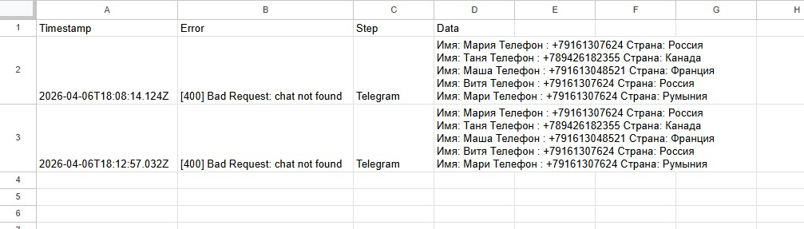

# Автоматизация обработки заявок из Google Form

## О проекте
Этот проект автоматизирует сбор заявок из Google Form и отправку их в Telegram и Email через Make.

## Задача
Сделать так, чтобы заявки:
- не терялись
- приходили автоматически
- отправлялись в удобном виде
- не создавали спам из множества отдельных сообщений

## Как работает
Google Form → Google Sheets → Make → Text Aggregator → Router → Telegram + Email

## Что реализовано
- сбор данных из Google Form через Google Sheets
- получение строк в Make
- объединение нескольких заявок в один текст
- отправка одного сообщения в Telegram
- отправка одного письма на Email
- аккуратное форматирование заявок

## Почему это полезно
Без автоматизации каждую заявку пришлось бы проверять вручную.  
С автоматизацией новые заявки собираются и отправляются автоматически одним сообщением.

## Использованные инструменты
- Google Forms
- Google Sheets
- Make
- Telegram Bot
- Gmail / Email

## Результат
Теперь несколько заявок из формы приходят:
- одним сообщением в Telegram
- одним письмом на почту

Это уменьшает количество уведомлений и делает обработку заявок удобнее.

## Чему я научилась
В этом проекте я научилась:
- связывать Google Form с Google Sheets
- настраивать сценарий в Make
- использовать Search Rows
- использовать Text Aggregator
- использовать Router
- отправлять уведомления в Telegram и Email
- красиво форматировать данные

 ## Обработка ошибок (Error Handling)

В сценарии реализована устойчивость к ошибкам:

- При ошибке Telegram выполняется повторная попытка (retry)
- Используется задержка (Sleep) перед повторной отправкой
- Если повторная попытка не удалась, сообщение отправляется на Email (fallback)
- Реализовано разделение логики через Router и фильтры

Это позволяет системе не падать при временных сбоях и гарантировать доставку уведомлений.

## 📊 Логирование и устойчивость системы

В проекте реализовано логирование ошибок и устойчивость к сбоям:

### 🔹 Логирование ошибок
Все ошибки автоматически записываются в Google Sheets со следующими данными:

- Время ошибки (timestamp)
- Текст ошибки (например: `[400] Bad Request: chat not found`)
- Шаг, на котором произошла ошибка (Telegram)
- Данные, которые не удалось отправить

Это позволяет:
- быстро находить причину ошибок
- анализировать сбои
- не терять данные

---

### 🔹 Retry (повторная попытка)
При временных ошибках система:
1. делает паузу (Sleep)
2. повторяет отправку в Telegram

Это повышает надёжность системы при:
- сетевых сбоях
- ограничениях API (rate limit)

---

### 🔹 Fallback (резервный канал)
Если повторная попытка не удалась:

👉 данные отправляются на Email

Это гарантирует, что заявки не теряются даже при сбое Telegram.

---

### 🔹 Разделение ошибок (умная обработка)
Система различает типы ошибок:

- временные (например, 429 или timeout) → retry
- постоянные (например, chat not found) → сразу fallback

---

## 🧠 Архитектурное решение

Сценарий построен по принципам устойчивых систем:

- Router для разделения логики
- Error Handler для перехвата ошибок
- Retry для временных сбоев
- Fallback для гарантированной доставки
- Logging для диагностики

---

## 📈 Результат

Система:
- не падает при ошибках
- не теряет данные
- позволяет анализировать проблемы
- масштабируется под реальные задачи

---

## 💡 Вывод

В рамках проекта реализована не просто автоматизация, а устойчивая система обработки лидов с элементами production-подхода.

  ## Скриншоты

### Сценарий в Make

### Сообщение в Telegram

### Email уведомление

### Логирование

